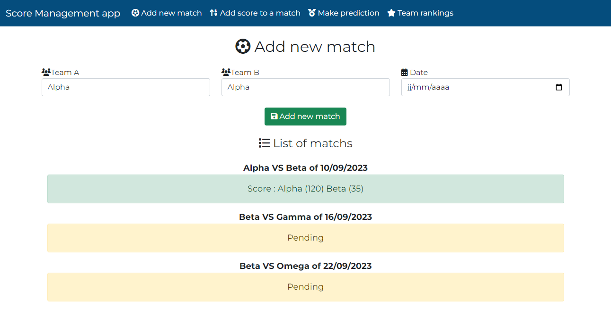

# score-management-app
### Database relational schema

### Module used 
The application was implemented using the Nodejs runtime and the ExpressJs mini framework.

The following modules are used:
 * body-parser
 * mySql2
 * jwt
 * ExpressJs
 * express-session

### Functionality implemented

* Create matches between two teams
* Assign scores to teams in a match
* Predict a score for a match
* Assign statistics to players in a team (backend only)
* Obtain information about a match (backend only)
  <b style="color:red">Unfinished project.</b>

### Authentication
Connection information

username : kirilinko   
password : 00000

### Start project

*1* - First run the ``npm install`` command to install the necessary modules
*2* - Then import the database into your database management system (phpmyadmin or mysql workbranch or others... )
*3* - Then launch the project with ``npm start``.

### Screenshots
You can see the screenshots in the dedicated folder

